# Workshop: Data Visualization with `ggplot2` (Part I)
Therese Anders  
April 7, 2017  

# Introduction
This workshop provides an introduction to data visualization in `R` using the `ggplot2` package. The two part workshop is designed to give undergraduate and graduate research assistants a first course in producing publication ready graphs in `R`. The first part of the workshop introduces univariate graphical data summaries, parameters that control the appearance of the plot, the visualization of data across multiple groups, and how to save plots.

In this first workshop, we use data from the [World Development Indicators](http://databank.worldbank.org/data/home.aspx). Specifically, we look at different indicators for the energy consumption of all countries in the WDI dataset for the past 25 years. For the sake of time, I downloaded and cleaned the data prior to the workshop. The code to clean the data (`clean_wdi.R`) is available on the [GitHub repository](https://github.com/thereseanders/Workshop-Intro-to-ggplot2/tree/master/data). 

## Review: Reading the data into `R`
We start by a) setting the working directory, b) installing the `ggplot2` package, and c) loading the `ggplot2` package into the environment.

```r
setwd("/Users/thereseanders/Documents/UNI/USC/Spring_2017/SPECRTraining/Part1")
#install.packages("ggplot2")
library(ggplot2)
```

Now, we can read the file `wdi_cleaned.csv`. Remember, that in order to read `.csv` files with the `read.csv()` function, you need to first load the `foreign` package.

```r
library(foreign)
dat <- read.csv("./data/wdi_cleaned_part1.csv",
                stringsAsFactors = F)
```

## Getting an overview of the data
The dataset contains 5425 observations on 5 variables. We can tell `R` to give us an overview of the data using the `str()` function. We can also take a look at the dataset in a spreadsheet format with the `View()` function.

```r
str(dat)
```

```
## 'data.frame':	5425 obs. of  5 variables:
##  $ country            : chr  "Afghanistan" "Albania" "Algeria" "American Samoa" ...
##  $ year               : int  1992 1992 1992 1992 1992 1992 1992 1992 1992 1992 ...
##  $ electricity_pop    : num  NA NA NA NA NA NA NA NA NA NA ...
##  $ energyuse_pop      : num  NA 418 884 NA NA ...
##  $ renewable_energyuse: num  62.24 46.03 0.29 NA NA ...
```

The dataset contains the following variables:

* `year`: Variable coding the year of observation.
* `country`: Variable coding the country of observation.
* `electricity_pop`: Access to electricity (% of population).
* `energyuse_pop`: Energy use (kg of oil equivalent per capita).
* `renewable_energyuse`: Renewable energy consumption (% of total final energy consumption).

# `ggplot2` package
The `ggplot2` package was developed by [Hadley Wickham](http://hadley.nz) based on Leland Wilkinson's "grammar of graphics" principles. According to the "grammar of graphics," you can create each graph from the following components: "a data set, a set of geoms--visual marks that represent data points, and a coordinate
system" ([Data Visualization with ggplot2 Cheat Sheet](https://www.rstudio.com/wp-content/uploads/2015/03/ggplot2-cheatsheet.pdf]).

For most applications, the code to produce a graph in `ggplot2` is roughly structured as follows:

`ggplot(data = , aes(x = , y = , color = , linetype = )) +`

  `geom()` +
  
  `[other graphical parameters, e.g. title, color schemes, background]`
  
* `ggplot()`: Function to initiate a graph in `ggplot2`.
* `data`: Specifies the data frame from which the plot is produced.
* `aes()`: Specifies aesthetic mappings that describe how variables are mapped to the visual properties of the graph. The minimum value that needs to be specified (for univariate data visualization) is the `x` parameter, where `x` specifies the variable to be plotted on the x-axis. Analogously, the `y` parameter specifies the variable to be plotted on the y-axis. Other examples include the `color` parameter, which specifies the variable to be onto different colors, or the `linetype` parameter, which specifies the variable to be mapped onto different line types in case of line graphs.
* `geom()`: Specifies the type of plot to use. There are many different geoms ("geometric objects") to be specified with the `geom()` layer. Some of the most common ones include `geom_point()` for scatterplots, `geom_line()` for line graphs, `geom_boxplot()` for Boxplots, `geom_bar()` for bar plots for discrete data, and `geom_histogram()` for continuous data. 

For an overview of the most important functions and geoms available through `ggplot2`, see the `ggplot2` [cheat sheet](https://www.rstudio.com/wp-content/uploads/2015/03/ggplot2-cheatsheet.pdf).

# Univariate visualizations
## Histograms
Histograms graph the distribution of continuous variables. In this first example, we graph the distribution of the variable `electricity_pop`. Note that because `electricity_pop` specifies a percentage, its value is bound between 0 and 100.

```r
summary(dat$electricity_pop)
```

```
##    Min. 1st Qu.  Median    Mean 3rd Qu.    Max.    NA's 
##    0.00   53.44   92.68   75.74  100.00  100.00    4789
```

```r
ggplot(dat, aes(electricity_pop)) +
  geom_histogram()
```

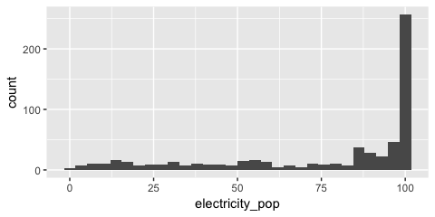<!-- -->

**Question 1** Can you make sense of this graph? What is plotted on the x-axis? What is plotted on the y-axis? What specifies the width of each bar? What specifies the height of each bar? 

*A histogram plots the distribution of a variable. The x-axis specifies the values of the variable. The y-axis specifies the number of observations for each value (or group of values) of the variable. The width of the bar specifies which values of the variable are grouped into one bin. The height of the bar specifies the number of observations in each bin.*

**Question 2** Which conclusions do you draw from the histogram above about the distribution of the availability of electricity in the world?

*The distribution is not normal (i.e. not a bell curve). It is skewed to the left. There are a lot more observations at the upper than the lower end of the scale, i.e. more country-years have high levels of availability of electricity than low levels.*

### Adjusting the number of bins
The default number of bins is 30, which means that the entire range of the variable (here 0 to 100) is split into 30 equally spaced bins. We can change the number of bins manually. In this example, since the variable is bound between 0 and 100, specifying `bins = 5` means that approximately values between 0-19 are grouped into one bin, values between 20-39 and so on.

```r
ggplot(dat, aes(electricity_pop)) +
  geom_histogram(bins = 5)
```

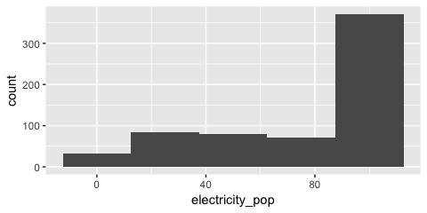<!-- -->

**Question 3**
How does the graph change if we specify `bins = 100`?


```r
ggplot(dat, aes(electricity_pop)) +
  geom_histogram(bins = 100)
```

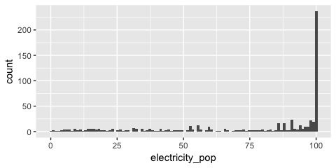<!-- -->


## Density plots
We saw that the shape of the distribution is highly influenced by how many bins we specify. If we specify too few bins, we run the risk of masking a lot of variation within the bins. If we specify too many bins, we trade parsimony for detail--which might make it harder to draw conclusions about the overall distribution of the variable of interest from the graph.

Density plots are continuous alternatives to histograms that do not rely on bins. We will cover details about the mechanics behind density plots and their estimation here. Just know that we can interpret the height of the density curve in a similar way that we interpreted the height of the bars in a histogram: The higher the curve, the more observations we have at that specific value of the variable of interest. In this first example, we use the `geom_density()` function to create the density plot.

```r
ggplot(dat, aes(electricity_pop)) +
  geom_density()
```

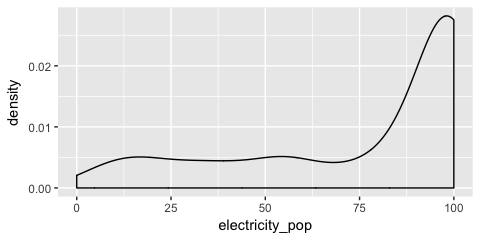<!-- -->

If you do not want the density graph to be plotted as a closed polygon, you can instead use the `geom_line()` geometric object function with the `stat = "density"` parameter.

```r
ggplot(dat, aes(x = electricity_pop)) +
  geom_line(stat = "density")
```

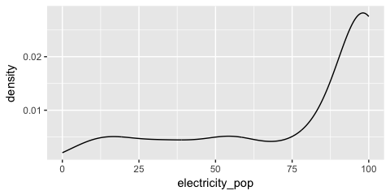<!-- -->

# Controlling the appearance of graphs
The default graphs we have produced so far are not (yet) ready for publication. In particular, they lack informative labels. In addition, we might want to change the appearance of the graph in terms of size, color, linetype, etc.

## Adding title, subtitle, and axes titles
We can specify titles and axes labels within the  `labs()` argument. 

```r
ggplot(dat, aes(x = electricity_pop)) +
  geom_line(stat = "density") +
  labs(title = "Distribution of access to electricity across all countries",
       subtitle = "Data source: World Development Indicators",
       x = "Percentage of the population with access to electricity",
       y = "Density")
```

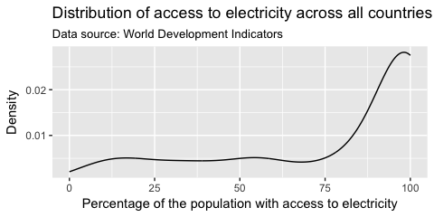<!-- -->


## Adjusting the range of the axes
By default, `ggplot()` adjusted the y-axis to start not at zero but at approximately 0.2 to reduce the amount of empty space in the plot. This might confuse the viewer, as it visually underestimates the height of the density curve--in particular for lower values of the variable. We can manually adjust the range of the axes using the `coord_cartesian()` parameter.

```r
ggplot(dat, aes(x = electricity_pop)) +
  geom_line(stat = "density") +
  labs(title = "Distribution of access to electricity across all countries",
       subtitle = "Data source: World Development Indicators",
       x = "Percentage of the population with access to electricity",
       y = "Density") +
  coord_cartesian(ylim = c(0, 0.03))
```

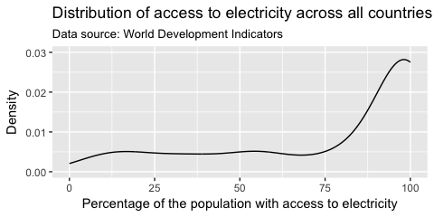<!-- -->

**Caution!!** You will sometimes see the command `scale_y_continuous(limits = c(0, 0.03))` instead of `coord_cartesian(ylim = c(0, 0.03))`. Note that these are not the same. `coord_cartesian()` only adjusts the range of the axes (it "zooms" in and out), while `scale_y_continuous(limits = c())` subsets the data. For density plots, this does not make a difference. But there are other examples where it alters the actual shape of the graph, rather than just the part of the graph that is visible.

## Changing the color
Any changes to the appearance of the curve itself are made within the argument that specifies the geometric object to be plotted, here `geom_line()`. `R` knows many colors by name; for a great overview see http://www.stat.columbia.edu/~tzheng/files/Rcolor.pdf.  

```r
ggplot(dat, aes(x = electricity_pop)) +
  geom_line(stat = "density", color = "darkblue") +
  labs(title = "Distribution of access to electricity across all countries",
       subtitle = "Data source: World Development Indicators",
       x = "Percentage of the population with access to electricity",
       y = "Density") +
  coord_cartesian(ylim = c(0, 0.03))
```

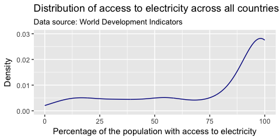<!-- -->

We can also use hexadecimal or RGB (red, green, blue) strings to specify colors. There are plenty of online tools to pick colors and extract hexadecimal or RBG strings. One of my favorites is http://www.colorhexa.com. This online tool allows you to specify a color name, hexadecimal, or RGB string, and returns information on color schemes, complementary colors, as well as alternative shades, tints, and tones. It also offers a color blindness simulator.

Suppose, I like the general tone of the darkblue color above, but am worried that it is a bit too dark for my plot. I enter the color "darkblue" into the search field at http://www.colorhexa.com and look for a brighter alternative. Suppose I really like the color displayed in the second tile from the left on the tints scale. I can extract this color's hexadecimal value of `#2727ff` by hovering over the tile of that color.

```r
ggplot(dat, aes(x = electricity_pop)) +
  geom_line(stat = "density", color = "#2727ff") +
  labs(title = "Distribution of access to electricity across all countries",
       subtitle = "Data source: World Development Indicators",
       x = "Percentage of the population with access to electricity",
       y = "Density") +
  coord_cartesian(ylim = c(0, 0.03))
```

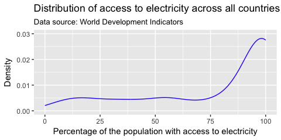<!-- -->

## Changing the line type
We can adjust the type of the line via the `linetype` parameter within `geom_line()`. For an overview of line types see  http://sape.inf.usi.ch/quick-reference/ggplot2/linetype.

```r
ggplot(dat, aes(x = electricity_pop)) +
  geom_line(stat = "density", color = "#2727ff", linetype = "dotdash") +
  labs(title = "Distribution of access to electricity across all countries",
       subtitle = "Data source: World Development Indicators",
       x = "Percentage of the population with access to electricity",
       y = "Density") +
  coord_cartesian(ylim = c(0, 0.03))
```

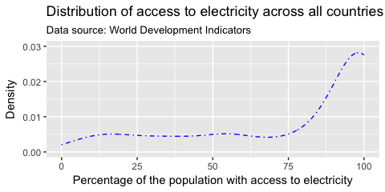<!-- -->

## Changing the width of the line
We can adjust the width of the line via the `size` parameter within `geom_line()`. Note that the `size` parameter is universal in the way that it controls line width in line plots and point size in scatter plots.

```r
ggplot(dat, aes(x = electricity_pop)) +
  geom_line(stat = "density", color = "#2727ff", size = 3) +
  labs(title = "Distribution of access to electricity across all countries",
       subtitle = "Data source: World Development Indicators",
       x = "Percentage of the population with access to electricity",
       y = "Density") +
  coord_cartesian(ylim = c(0, 0.03))
```

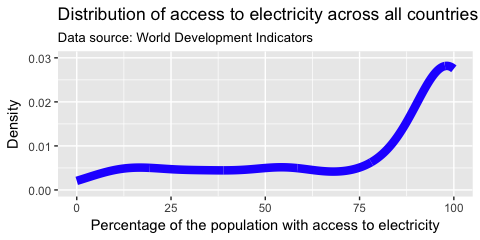<!-- -->

## Changing the opacity of the line
We can adjust the opacity of the line via the `alpha` parameter within any geometric object. The `alpha` parameter ranges between zero and one. Adjusting the opacity of the geometric objects is especially important when plotting multiple lines (or objects) in the same graph to reduce overplotting.

```r
ggplot(dat, aes(x = electricity_pop)) +
  geom_line(stat = "density", color = "#2727ff", size = 3, alpha = 0.3) +
  labs(title = "Distribution of access to electricity across all countries",
       subtitle = "Data source: World Development Indicators",
       x = "Percentage of the population with access to electricity",
       y = "Density") +
  coord_cartesian(ylim = c(0, 0.03))
```

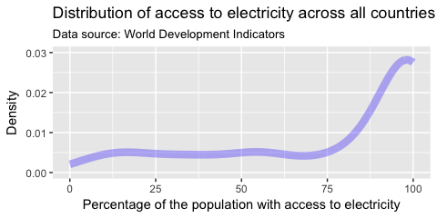<!-- -->

# Graphing distributions across groups
## Using different colors
Sometimes, we want to compare distributions across different groups in our data set. Suppose, we wanted to assess how the distribution of the access to electricity changes over time. We have three years of observations for our variable: 2000, 2010, and 2012.

```r
table(dat$year[!is.na(dat$electricity_pop)])
```

```
## 
## 2000 2010 2012 
##  212  212  212
```

We pass a separate color to the distribution of the `electricity_pop` for each year by specifying the `color` parameter within the aesthetics. Since the year parameter is currently specified as a numerical variable, we also need to specify that `ggplot` should treat it as a `factor` (i.e. a categorical variable).

```r
ggplot(dat, aes(x = electricity_pop, color = factor(year))) +
  geom_line(stat = "density") +
  labs(title = "Distribution of access to electricity across all countries",
       subtitle = "Data source: World Development Indicators",
       x = "Percentage of the population with access to electricity",
       y = "Density")  +
  coord_cartesian(ylim = c(0, 0.03))
```

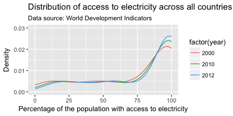<!-- -->

**Question 4** Review: What is the difference between specifying the `color` parameter outside the `aes()` argument versus within the `aes()` argument?

*If the color parameter is specified outside the `aes()` argument, one color is passed all geometric objects of the same type. If the color parameter is specified within the `aes()` argument, different colors are passed to each value of the variable that is passed to the `color` parameter. A separate geometric object will be plotted for value--each in a different color.*

**Question 5** How would you interpret this plot? How did the access to electricity change over time?

*Over time, the amount of country-years with high levels of access to electricity (90% to 100% of the population) has increased. In later years, there are fewer observations at very low levels of access to electricity and there are fewer country-years in which approximately 75% to 90% of the population had access to electricity.*

We can use custom colors to distinguish between the three years using the `scale_color_manual()` function. This will change the colors in both the plot and the legend. Let us choose triadic colors to "darkorange" from http://www.colorhexa.com. Within the `scale_color_manual()` argument, we can also specify a name and labels for the legend.

```r
ggplot(dat, aes(x = electricity_pop, color = factor(year))) +
  geom_line(stat = "density") +
  labs(title = "Distribution of access to electricity across all countries",
       subtitle = "Data source: World Development Indicators",
       x = "Percentage of the population with access to electricity",
       y = "Density")  +
  coord_cartesian(ylim = c(0, 0.03)) +
  scale_color_manual(values = c("#8c00ff",
                                "#ff8c00",
                                "#00ff8c"),
                     name = "Year")
```

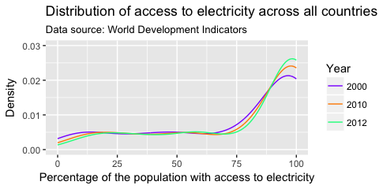<!-- -->


## Using different linetypes
Many academic journals will only accept graphs on a gray scale. This means that color will not be enough to differentiate the three lines. We can use different line types instead by specifying the `linetype` parameter within the `aes()` argument.. This also makes the graph more color blind friendly.

```r
ggplot(dat, aes(x = electricity_pop, linetype = factor(year))) +
  geom_line(stat = "density") +
  labs(title = "Distribution of access to electricity across all countries",
       subtitle = "Data source: World Development Indicators",
       x = "Percentage of the population with access to electricity",
       y = "Density")  +
  coord_cartesian(ylim = c(0, 0.03))
```

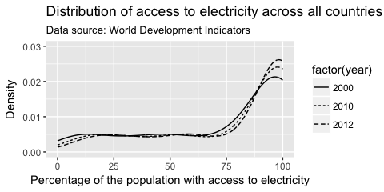<!-- -->

## Faceting
Another option to graph different groups is to use faceting. This means to plot each value of the variable upon which we facet in a different panel within the same plot. Here, we will use the `facet_wrap()` function. We could also use the `facet_grid()` which allows faceting across more than one variable.

```r
ggplot(dat, aes(x = electricity_pop)) +
  geom_line(stat = "density") +
  labs(title = "Distribution of access to electricity across all countries",
       subtitle = "Data source: World Development Indicators",
       x = "Percentage of the population with access to electricity",
       y = "Density")  +
  coord_cartesian(ylim = c(0, 0.03)) +
  facet_wrap(~ year)
```

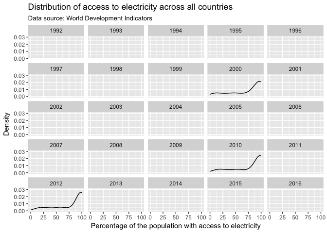<!-- -->

The `facet_wrap()` function draws a separate plot for each year in the data set. Since we only have data for 2000, 2010, and 2012, we subset the plot to omit empty panels. We can either create a new subsample data frame, or use the `subset()` command directly within `ggplot()`. Here, we explicitly choose the years 2000, 2010, and 2012. Alternatively, we could also subset to all non-missing observations on the variable `electricity_pop`.

```r
ggplot(subset(dat, year %in% c(2000, 2010, 2012)), aes(x = electricity_pop)) +
  geom_line(stat = "density") +
  labs(title = "Distribution of access to electricity across all countries",
       subtitle = "Data source: World Development Indicators",
       x = "Percentage of the population with access to electricity",
       y = "Density")  +
  coord_cartesian(ylim = c(0, 0.03)) +
  facet_wrap(~ year)
```

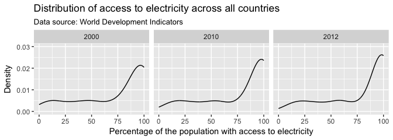<!-- -->

**Question 6** For this particular application, which alternative to show the distribution of the variable across groups do you think is the most appropriate? Why?

## Boxplots
Another way to show the distribution of variables across groups are boxplots. Boxplots graph different properties of a distribution:

* The borders of the box denote the 25th and 75th percentile.
* The line within the box denotes the median.
* The position of the whiskers (vertical lines) denote the first quartile value minus 1.5 times the interquartile range and the third quartile value plus 1.5 times the interquartile range. We will not go into details here.
* Dots denote outliers (values that lie outside the whiskers), if applicable.

In `ggplot2` we can graph boxplots across multiple variables using the `geom_boxplot()` geometric object.

```r
ggplot(subset(dat, year %in% c(2000, 2010, 2012)), 
       aes(x = factor(year), y = electricity_pop)) +
  geom_boxplot() +
  labs(title = "Distribution of access to electricity across all countries",
       subtitle = "Data source: World Development Indicators",
       x = "Year",
       y = "Percentage of the population with access to electricity")
```

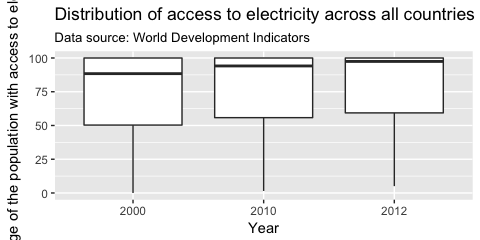<!-- -->

We can change the appearance of the boxplot using standard graphing parameters such as `color`, `fill`, and `width`.

```r
ggplot(subset(dat, year %in% c(2000, 2010, 2012)), 
       aes(x = factor(year), y = electricity_pop)) +
  geom_boxplot(width = 0.3, color = "firebrick4", fill = "firebrick1") +
  labs(title = "Distribution of access to electricity across all countries",
       subtitle = "Data source: World Development Indicators",
       x = "Year",
       y = "Percentage of the population with access to electricity")
```

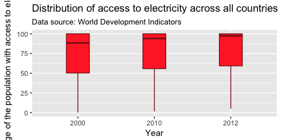<!-- -->

We can change the orientation of the plot with the `coord_flip()` command, which will flip the axes.

```r
ggplot(subset(dat, year %in% c(2000, 2010, 2012)), 
       aes(x = factor(year), y = electricity_pop)) +
  geom_boxplot(width = 0.3, color = "firebrick4", fill = "firebrick1") +
  labs(title = "Distribution of access to electricity across all countries",
       subtitle = "Data source: World Development Indicators",
       x = "Year",
       y = "Percentage of the population with access to electricity") +
  coord_flip()
```

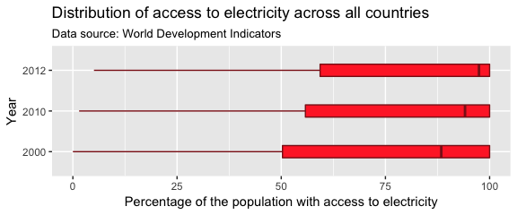<!-- -->

# Saving plots
We can output your plots to many different format using the `ggsave()` function, including but not limited to `.pdf`, `.jpeg`, `.bmp`, `.tiff`, or `.eps`. Here, we output the graph as a Portable Network Graphics (.png) file. We can specify the size of the output graph as well as the resolution in dots per inch (dpi). If no graph is specified, `ggsave()` will save the last graph that was executed. For us, this is the boxplot in horizontal orientation. If we no not specify the complete file path, the plot will be saved to your working directory.

```r
ggsave("boxplot_horizontal.png", width = 6, height = 3, dpi = 400)
```

