# Workshop: Data visualization with `ggplot2` (part II)
Therese Anders  
April 21, 2017  

# Introduction
In the second part of the workshop, we discuss the homework from the first part, introduce multivariate scatter and line plots, adding trend lines, and plotting simple maps.

As in the first part of this workshop, we use data from the [World Development Indicators](http://databank.worldbank.org/data/home.aspx) with a number of additional variables. Specifically, we look at different indicators for the energy consumption of all countries in the WDI dataset for the past 25 years. For the sake of time, I downloaded and cleaned the data prior to the workshop. The code to clean the data (`clean_wdi_.R`) is available on the [GitHub repository](https://github.com/thereseanders/Workshop-Intro-to-ggplot2/tree/master/data). 

* `year`: Variable coding the year of observation.
* `country`: Variable coding the country of observation.
* `electricity_pop`: Access to electricity (% of population).
* `gdppc`: GDP per capita, PPP (constant 2011 international $).
* `energyuse_pop`: Energy use (kg of oil equivalent per capita).
* `energyuse_gdp`: Energy use (kg of oil equivalent) per $1,000 GDP (constant 2011 PPP).
* `renewable_energyuse`: Renewable energy consumption (% of total final energy consumption).
* `time_electricity`: Time required to get permanent electricity connection in days.
* `rights_index`: Stength of legal rights (0 = weak, 12 = strong), that is "the degree to which collateral and bankruptcy laws protect the rights of borrowers and lenders" (World Development Indicators Metadata).

# Homework from workshop 1
First, we set the working directory, load the `ggplot2` and `foreign` packages into the environment, and load the data. Note that the data set used in part I is a subset of the data set used in part II--we can therefore create the plots from the homework with the data for part II.

```r
setwd("/Users/thereseanders/Documents/UNI/USC/Spring_2017/SPECRTraining/Part2")
library(ggplot2)
library(foreign)
dat <- read.csv("./data/wdi_cleaned_part2.csv",
                stringsAsFactors = F)
```

## Graph 1

```r
ggplot(subset(dat, year %in% c(1992, 2002, 2012)), 
       aes(x = renewable_energyuse, 
           color = factor(year), 
           linetype = factor(year))) +
  geom_line(stat = "density") +
  labs(title = "Distribution of renewable energy use across all countries",
       subtitle = "Data source: World Development Indicators",
       x = "Renewable energy consumption (% of total final energy consumption)",
       y = "Density") + 
  theme_bw() +
  scale_color_manual(name = "Year",
                     values = c("darkorange",
                                "cyan",
                                "blue")) +
  scale_linetype_manual(name = "Year",
                        values = c("dotted",
                                   "solid",
                                   "dashed")) +
  theme(legend.key.size = unit(1, "cm")) +
  coord_cartesian(ylim = c(0, 0.02))
```

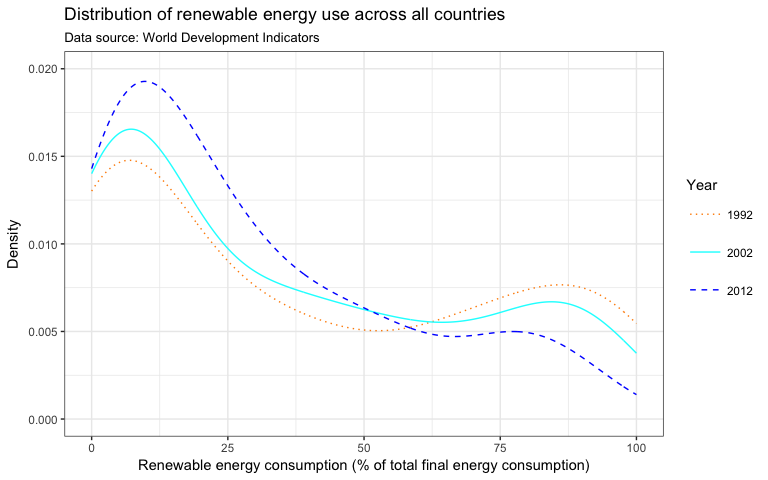<!-- -->

## Graph 2

```r
ggplot(subset(dat, country %in% c("United States",
                                  "Germany",
                                  "Brazil",
                                  "Russian Federation",
                                  "India",
                                  "China")), 
       aes(x = energyuse_pop)) +
  geom_density(fill = "blue", alpha = 0.3, color = NA) +
  facet_wrap(~ factor(country), ncol = 2) +
  theme_bw() +
  labs(title = "Per capita energy consumption between 1992 and 2014",
       subtitle = "Data source: World Development Indicators",
       x = "Energy use (kg of oil equivalent per capita)",
       y = "Density")
```

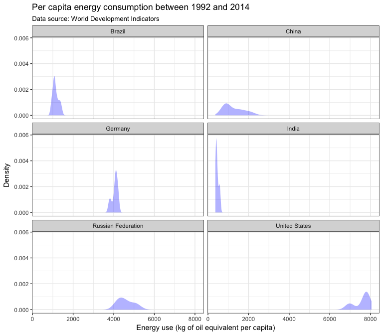<!-- -->

# Multivariate graphs
In the first session, we talked about univariate data summary graphs like density graphs or histograms in which we plot the range of values of a variable on the x-axis and the density or count of observations on the y-axis. 

In this second session, we will plot two variables--one on the x- and one on the y-axis--against each other with the option of showing the value of additional variable(s) through color, shapes, or other aesthetics.

## Scatterplots
Scatterplots show the relationship between two variables with the help of points (or other shapes). In `ggplot2` we use the `geom_point()` geometric object to create scatterplots. As an example, we plot the evolution of the worldwide renewable energy usage over time.

```r
ggplot(dat, aes(x = year, y = renewable_energyuse)) +
  geom_point()
```

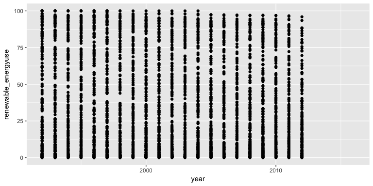<!-- -->

```r
table(dat$year)
```

```
## 
## 1992 1993 1994 1995 1996 1997 1998 1999 2000 2001 2002 2003 2004 2005 2006 
##  217  217  217  217  217  217  217  217  217  217  217  217  217  217  217 
## 2007 2008 2009 2010 2011 2012 2013 2014 2015 2016 
##  217  217  217  217  217  217  217  217  217  217
```

There are 217 observations per year. Due to overplotting, it is hard to draw conclusions from the plot. We have a number of ways in which we can adjust the appearance of the graph to highlight global trends in the data.

### Adjusting the opacity of points
One way to use overplotting actively to highlight trends in the data is to reduce the opacity of points. Points will still be plotted on top of each other, but overlaying multiple transparent points will create clusters that signal an agglomeration of data points.

In addition, we use a theme with a white background to further increase the visibility of clusters in the data. In this example, while reducing the opacity of points does not significantly aid our understanding of over-time trends in the data, the plot shows that in the majority of countries between 0% to 10% of the energy used comes from renewables.

```r
ggplot(dat, aes(x = year, y = renewable_energyuse)) +
  geom_point(alpha = 0.2) +
  theme_minimal()
```

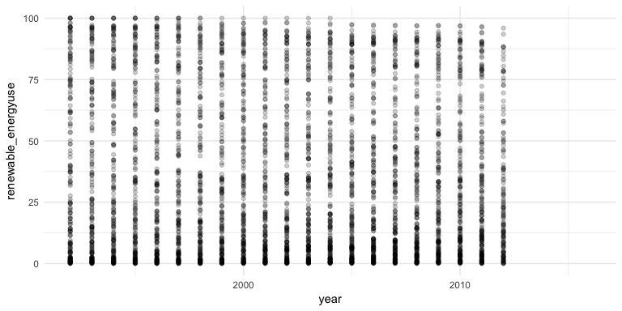<!-- -->

### Jitter
Jittering points is another way to reduce the negative effects of overplotting. The `position_jitter()` argument randomly adds small values to each point. This way, each point is randomly shifted a tiny bit to the top, right, bottom, or left. Note that unless you set a seed to control the randomness, a graph with a jitter function will appear a little bit different every time you execute it.


```r
ggplot(dat, aes(x = year, y = renewable_energyuse)) +
  geom_point(alpha = 0.2, position = position_jitter()) +
  theme_minimal()
```

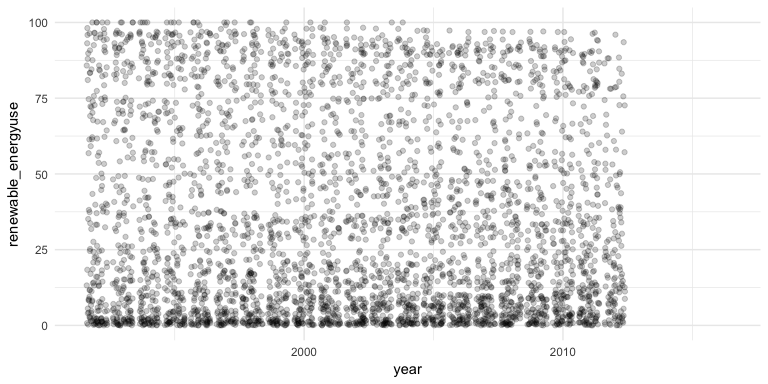<!-- -->

We can change the default jitter value with the `width` and `height` parameters inside the `position_jitter()` argument. The default is for the data points to occupy 80% of the implied bins (see http://ggplot2.tidyverse.org/reference/geom_jitter.html). In our case, by decreasing the jitter width, we can increase the visual separation between years.


```r
ggplot(dat, aes(x = year, y = renewable_energyuse)) +
  geom_point(alpha = 0.2, position = position_jitter(width = 0.2)) +
  theme_minimal()
```

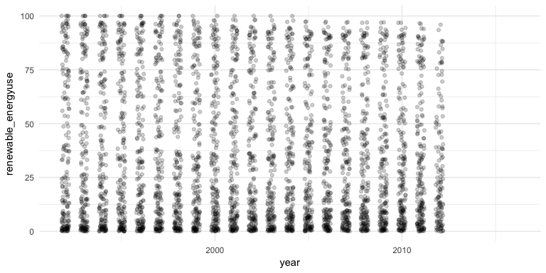<!-- -->

### Adding trend lines
Another way to highlight trends in the data is to overlay a scatterplot with a trend line. In `ggplot2` this is implemented using the `stat_smooth()` function. For example, we could overlay the graph with the line of best fit of a linear model that regresses the proportion of renewable energy usage on the year using the `method = "lm"` argument. The resulting graph suggests that globally, the usage of renewables has decreased over time.

```r
ggplot(dat, aes(x = year, y = renewable_energyuse)) +
  geom_point(alpha = 0.2, position = position_jitter(width = 0.2)) +
  theme_minimal() +
  stat_smooth(method = "lm")
```

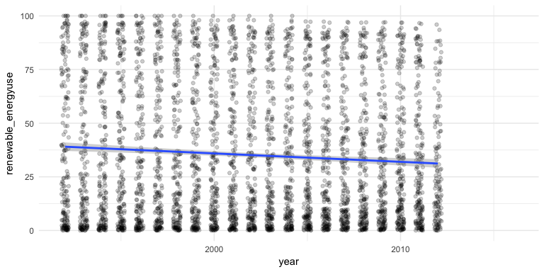<!-- -->


### Using color to distinguish groups
Suppose we wanted to know whether the evolution in the usage of renewable energies differs between richer and poorer countries. We could do this by creating a binary variable that codes the wealth of countries and passing this variable to the color aesthetic. Here, we will use the median per capita GDP value as a cut point to split the sample into two roughly equally sized groups. Another alternative would be to use the average per capita GDP as a cut-off.

```r
summary(dat$gdppc)
```

```
##     Min.  1st Qu.   Median     Mean  3rd Qu.     Max.     NA's 
##    246.7   2791.0   8322.0  15330.0  20680.0 137200.0      958
```

```r
dat$rich <- ifelse(dat$gdppc >= median(dat$gdppc, na.rm = T), 1, 0)
table(dat$rich)
```

```
## 
##    0    1 
## 2233 2234
```

By passing the newly created `rich` variable to the color aesthetic, all following geometric objects will be plotted for both groups. This means that both the `geom_point()` objects and the `stat_smooth()` objects will be plotted for rich and poor countries. There are a number of missing values in our new variable `rich`. To avoid plotting these as a separate group, we need to subset the data to not include missing values on the variable `rich`.

The plot suggests that rich countries have lower levels of renewable energy usage. Interestingly, on average, the percentage of energy that comes from renewables has not changed much over time for neither the rich nor the poor countries.

```r
ggplot(subset(dat, !is.na(rich)), 
       aes(x = year, 
           y = renewable_energyuse, 
           color = factor(rich))) +
  geom_point(alpha = 0.4, position = position_jitter(width = 0.2)) +
  theme_minimal() +
  stat_smooth(method = "lm")
```

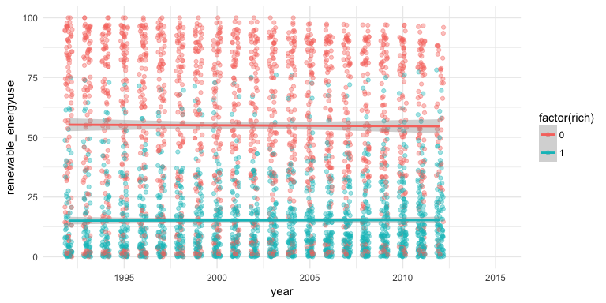<!-- -->

### Using shapes to distinguish groups
Sometimes, using color is not the optimal choice to distinguish groups, for example if we have to create plots on a grey scale or want to make sure our graphs are color blind save. We can instead use shapes to distinguish groups, or combine the distinction of shapes and color like in the example below.


```r
ggplot(subset(dat, !is.na(rich)), 
       aes(x = year, 
           y = renewable_energyuse, 
           color = factor(rich),
           shape = factor(rich))) +
  geom_point(alpha = 0.4, position = position_jitter(width = 0.2)) +
  theme_minimal() +
  stat_smooth(method = "lm")
```

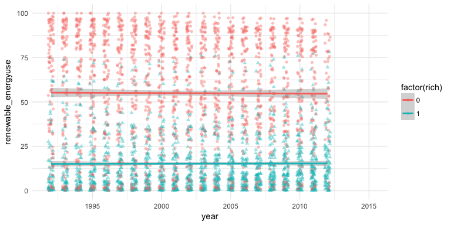<!-- -->

### Using faceting to distinguish groups
We can also plot separate scatterplots for each group using faceting. In the first part of this workshop, we used the `facet_wrap()` function which allows us to plot relationships across groups contained in a single variable. Today, we will instead use the `facet_grid()` function which allows us to plot the relationship across two variables.

Suppose, we wanted to know whether there is a difference in the relationship between per capita energy consumption and percentage of renewables in poorer versus richer countries; and we also wanted to know how the relationship changes over time. We will only plot the relationship for years in which data is available on the per capita energy consumption: 2000, 2010, and 2012.

We can draw a number of conclusions from the plot below. First, the relationship between per capita energy consumption and the degree to which renewables are used to produce energy does not change much over time. What does influence the relationship between the two variables of interest is the wealth of a country. In richer countries, the amount of energy used and the prevalence of renewables are not strongly related. In poorer countries, the more energy is consumed on average, the less renewables contribute to the production of energy. Note, however, that the wealth of a country and the amount of energy used per inhabitant are positively correlated with a correlation coefficient of 0.83 (pooled across all available observations). This means that on average, the more energy a country consumes per capita, the more similar it will be to a richer country. 

```r
ggplot(subset(dat, !is.na(rich) & year %in% c(1992, 2002, 2012)),
       aes(x = energyuse_pop, 
           y = renewable_energyuse)) +
  geom_point(alpha = 0.2) +
  theme_bw() +
  stat_smooth(method = "lm") +
  facet_grid(factor(year)~factor(rich))
```

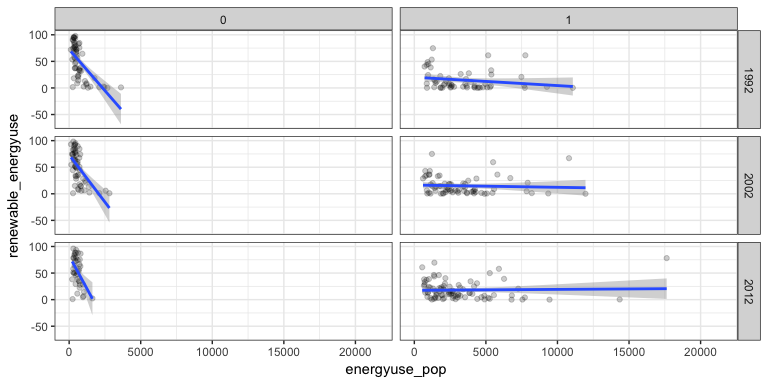<!-- -->

```r
cor.test(dat$energyuse_pop, dat$gdppc)
```

```
## 
## 	Pearson's product-moment correlation
## 
## data:  dat$energyuse_pop and dat$gdppc
## t = 82.541, df = 3069, p-value < 2.2e-16
## alternative hypothesis: true correlation is not equal to 0
## 95 percent confidence interval:
##  0.8190053 0.8409938
## sample estimates:
##       cor 
## 0.8303224
```


## Line graphs
One of the most common uses for line graphs is the display of data over time. For example, we could be plotting the evolution of GDP per capita over time. Within the `aes()` command, we specify which variable to be plotted on the x- and y-axis. The geometric object we use for line graphs is `geom_line()`.

We are working with a panel data set. This means that we have multiple observations over time for each country. Displaying all this information without grouping or subsetting does not results in a plot that is useful. In the plot below, `geom_line()` is trying to draw a line between all non-missing country-year observations for the variable `gdppc`.

```r
ggplot(dat, aes(x = year, y = gdppc)) +
  geom_line()
```

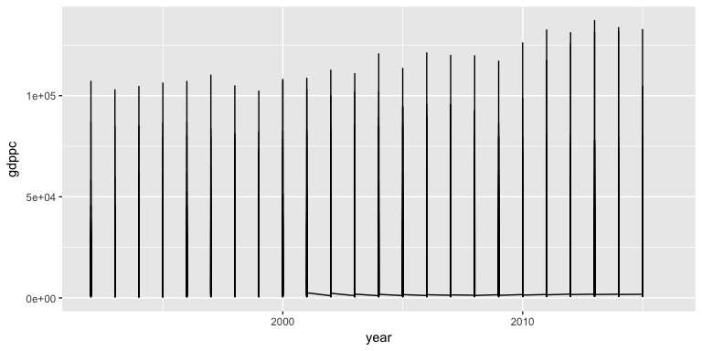<!-- -->

In order to plot one line per country, we can specify the `group` parameter inside the aesthetics argument. However, in this data set, even if we grouped the data by country, there are too many groups (countries) to be displayed in one graph.

```r
ggplot(dat, aes(x = year, y = gdppc, group = country)) +
  geom_line()
```

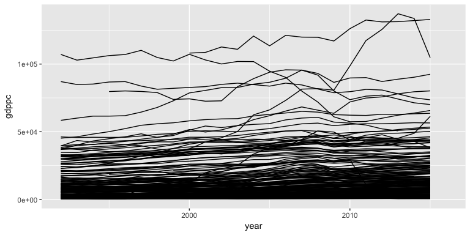<!-- -->

We will therefore use a subset of countries and plot the evolution of their per capita GDP over time. Suppose for example, we wanted to see how the per capita GDP has changed over time in member countries of the The North American Free Trade Agreement (NAFTA), that is Canada, Mexico, and the US. We can use subset inside the `ggplot()` function to plot a separate line for each of the countries.

```r
ggplot(subset(dat, country %in% c("Canada", "Mexico", "United States")), 
       aes(x = year, y = gdppc, group = country)) +
  geom_line()
```

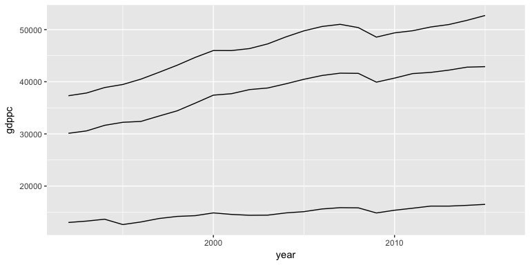<!-- -->

This graph does not tell us which line represents the evolution of per capita GDP in which country. We could add labels to each line to denote the country it represents. We could do this with the `geom_text()` function but this will add a label for each country-year observation.

```r
ggplot(subset(dat, country %in% c("Canada", "Mexico", "United States")), 
       aes(x = year, y = gdppc, group = country, label = country)) +
  geom_line() +
  geom_text()
```

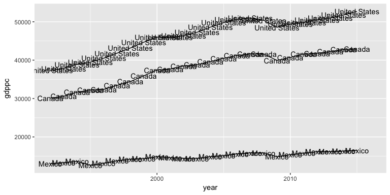<!-- -->

A better way to label each line (and not each country-year observation) is using the `directlabels` package and the `geom_dl()` geometric object in `ggplot()`. Note that you have to specify a method for the `geom_dl()` function to work (here: `"last.points"`). We can use the `cex` argument to control the size of the text labels. Here, I am also adjusting the range of the x-axis to ensure that all lines are properly labeled. The graph shows that the evolution of wealth in the three countries is intimately connected. Crises and upswings in show the same patterns for the US, Canada, and Mexico. However, the increase of per capita GDP appears to be a lot steeper in Canada and the US than in Mexico, despite similar trends.

```r
#install.packages("directlabels")
library(directlabels)
ggplot(subset(dat, country %in% c("Canada", "Mexico", "United States")), 
       aes(x = year, y = gdppc, group = country)) +
  geom_line() +
  geom_dl(aes(label = country), method = ("last.points"), cex = 0.5) +
  coord_cartesian(xlim = c(1992, 2020))
```

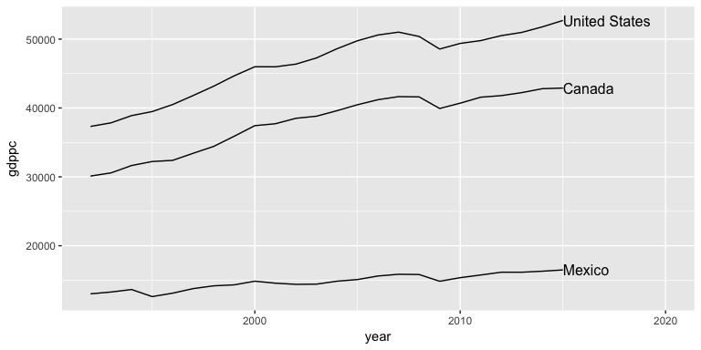<!-- -->

It is not necessary in this example, but sometimes we would like to show which observations go into the computation of the line by adding points. Remember, that ggplot uses layers to graph multiple geometric objects in one plot. We can therefore just overlay the line plot with a `geom_point()` layer.

```r
ggplot(subset(dat, country %in% c("Canada", "Mexico", "United States")), 
       aes(x = year, y = gdppc, group = country)) +
  geom_line() +
  geom_dl(aes(label = country), method = ("last.points"), cex = 0.5) +
  geom_point(color = "tomato") +
  coord_cartesian(xlim = c(1992, 2020))
```

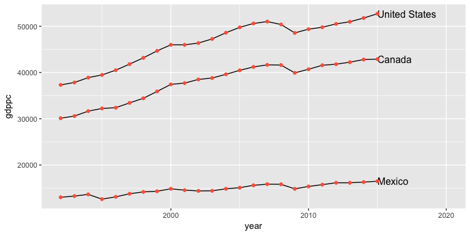<!-- -->

# Introduction to maps 
We will use map data that is part of the maps package in R and does not require significant preprocessing before plotting. The `maps` package (https://cran.r-project.org/web/packages/maps/index.html) contains data on lines and polygons for a number of geographical units, including but not limited to, countries of the world, a database of large lakes, as well as United States federal states, counties, and cities. In this example, we retrieve data for a world map.

Before plotting the data, let us look at the structure of the data we drew from the `maps` package. The data is stored as a data frame and contains observations that are characterized by unique combinations of longitude and latitude values. In addition, each observation has the following attributes: group, order, region, and subregion if applicable.

```r
#install.packages("maps")
library(maps)
dat_map <- map_data("world")
head(dat_map)
```

```
##        long      lat group order region subregion
## 1 -69.89912 12.45200     1     1  Aruba      <NA>
## 2 -69.89571 12.42300     1     2  Aruba      <NA>
## 3 -69.94219 12.43853     1     3  Aruba      <NA>
## 4 -70.00415 12.50049     1     4  Aruba      <NA>
## 5 -70.06612 12.54697     1     5  Aruba      <NA>
## 6 -70.05088 12.59707     1     6  Aruba      <NA>
```

The longitude and latitude information denotes points along the borders of countries and geographical regions. We can represent them as points in the x-y-coordinate system, plotting the longitude along the x-axis and latitude along the y-axis.

```r
ggplot(dat_map, aes(x = long, y = lat)) +
  geom_point()
```

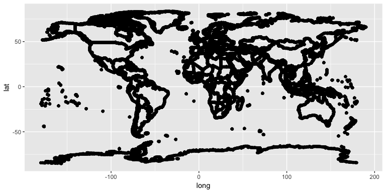<!-- -->

We can use `ggplot2`’s `geom_polygon()` function to plot the observations as polygons, rather than points. In order to do that, we need to specify the grouping parameter. The `geom_polygon()` function connects the points for each group in the order of the data set (think of connecting dots on a sheet of paper without lifting your pen). This means that if the data is not already in the appropriate order, we need to sort it before plotting.

```r
ggplot(dat_map, aes(x = long, y = lat, group = group)) +
  geom_polygon()
```

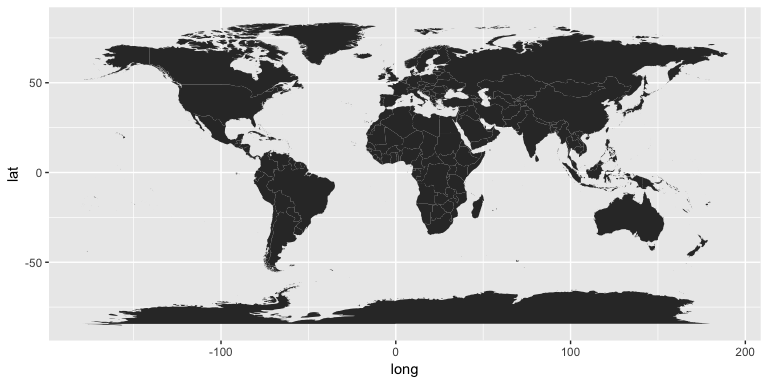<!-- -->

## Choropleth maps
Choropleth maps use differences in shading of specific geographic regions to visualize data. Here, we will plot a map of the world where the shading denotes differences in the use of renewable energy across countries.

To plot the choropleth map, we will first need to **merge** our world map data with the data from the World Development Indicators. Unfortunately, country names differ between the two data sets. Therefore, we use the `countrycode()` function from the `countrycode` package to create vector of matching country codes for the two data sets before merging. We will use the `full_join()` function from the `dplyr` package for merging.

```r
#install.packages("countrycode")
#install.packages("dplyr")
library(countrycode)
library(dplyr)
dat_map$ccode <- countrycode(dat_map$region, 
                             origin = "country.name", 
                             destination = "wb")

dat$ccode <- countrycode(dat$country,
                             origin = "country.name",
                             destination = "wb")

merged <- full_join(dat_map, dat, by = "ccode")
```

Now, we can plot our data. Suppose we wanted to illustrate the spatial variation of the usage of renewables in 2010. We plot the map as before, but pass the `renewable_energyuse` to the `fill` parameter inside the aesthetics argument. In addition, we specify that we only want to use data from 2010, using the `subset()` command when specifying the data frame. Note that we use our newly created `merged` data frame, rather than `dat_map`.

```r
ggplot(subset(merged, year == 2010), 
       aes(x = long, y = lat, group = group, fill = renewable_energyuse)) +
  geom_polygon()
```

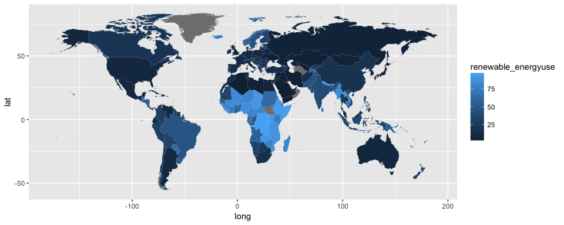<!-- -->

The `ggplot2` default color scheme does not illustrate differences in the use of renewable energy particularly well. We can customize the color scheme to make differences between countries more apparent.

```r
ggplot(subset(merged, year == 2010), 
       aes(x = long, y = lat, group = group, fill = renewable_energyuse)) +
  geom_polygon() +
  scale_fill_gradient(low = "red", high = "green") +
  theme_minimal()
```

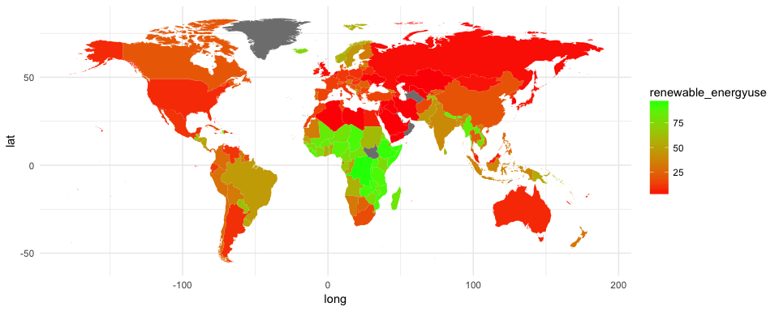<!-- -->

